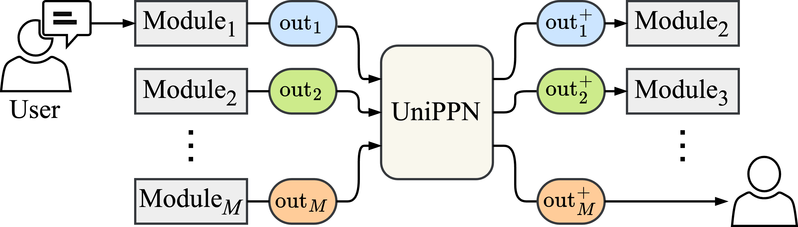

# Universal Post-Processing Network (UniPPN)
This is a pytorch implementation of the paper ["Universal Post-Processing Networks for Joint Optimization of Modules in Task-Oriented Dialogue Systems" (AAAI 2025)](https://arxiv.org/abs/2502.00747).

<p align="center">
  
</p>

**Abstract:**
Post-processing networks (PPNs) are components that modify the outputs of arbitrary modules in task-oriented dialogue systems and are optimized using reinforcement learning (RL) to improve the overall task completion capability of the system. However, previous PPN-based approaches have been limited to handling only a subset of modules within a system, which poses a significant limitation in improving the system performance. In this study, we propose a joint optimization method for post-processing the outputs of all modules using universal post-processing networks (UniPPNs), which are language-model-based networks that can modify the outputs of arbitrary modules in a system as a sequence-transformation task. Moreover, our RL algorithm, which employs a module-level Markov decision process, enables fine-grained value and advantage estimation for each module, thereby stabilizing joint learning for post-processing the outputs of all modules. Through both simulation-based and human evaluation experiments using the MultiWOZ dataset, we demonstrated that UniPPN outperforms conventional PPNs in the task completion capability of task-oriented dialogue systems.

## Installation
Python 3.9 is required to install the dependencies.

```bash
pip install -r requirements.txt
```


## Reproducing the Results
The following steps will guide you through reproducing the results of the paper.

### 1. Prepare models
Some of the models used in the paper are not included in this repository, so you need to download or train them first.

1. Download the MultiWOZ 2.3 dataset
    - We use the MultiWOZ 2.3 dataset to train some models such as D3ST and PPTOD. Go to the [`dataset/`](dataset/) directory and follow the instructions in `README.md` to download and extract the MultiWOZ 2.3 dataset.

2. Prepare the models and other related files (e.g., tokenizers and config files) by following the instructions in the corresponding directories:
    | Module | Model | Directory |
    | --- | --- | --- |
    | NLU | BERT | [`system/nlu/bert/README.md`](system/nlu/bert/README.md) |
    | DST | D3ST | [`system/dst/d3st/README.md`](system/dst/d3st/README.md) |
    | Policy | LAVA | [`system/policy/lava/README.md`](system/policy/lava/README.md) |
    | NLG | SC-GPT | [`system/nlg/scgpt/README.md`](system/nlg/scgpt/README.md) |
    | End-to-End | PPTOD | [`system/e2e/pptod/README.md`](system/e2e/pptod/README.md) |

### 2. Sample dialogue history
Use `run_simulation.py` to sample dialogues between the user simulator and the dialogue system as follows:

```bash
sys_name=sys_ppo
python run_simulation.py \
    --ddp_type default \
    --num_sample_turns 10000 \
    --run_dpath outputs/init_data/${sys_name}-10k \
    --random_seed 1 \
    --system_name ${sys_name}
```
This will create 10k turns of dialogue samples in `outputs/init_data/${sys_name}-10k`. You can see the specific commands we used in the `scripts/sample_dialogues.sh`.

Here, `sys_name` is the name of the system you want to sample dialogues from. You can choose from the following systems used in the paper: `sys_rul`, `sys_d3st`, `sys_ppo`, `sys_lava`, `sys_scl`, `sys_scg`, `sys_pptod`, and `sys_gpt4om`.

### 3. Imitation learning
Use `run_il.py` to initialize the UniPPN using imitation learning on the sampled dialogues as follows:

```bash
sys_name=sys_ppo

# 1 First train only embeddings
python run_il.py \
    --seed 12 \
    --model_name_or_path openai-community/gpt2-medium \
    --output_dir outputs/il/${sys_name}-unippn-emb \
    --ppn_target_modules "nlu dst policy nlg" \
    --train_only_embeddings True \
    --init_data_dir outputs/init_data/${sys_name}-10k \
    --num_turns 10000

# 2 Then train all parameters
python run_il.py \
    --seed 123 \
    --model_name_or_path outputs/il/${sys_name}-unippn-emb \
    --output_dir outputs/il/${sys_name}-unippn-full \
    --ppn_target_modules "nlu dst policy nlg" \
    --train_only_embeddings False \
    --num_turns 10000
```
This will save the trained UniPPN model in `outputs/il/${sys_name}-unippn-full`.
You can see the specific commands and hyperparameters we used in the `scripts/run_il.sh`.

### 4. Reinforcement learning
Use `run_rl.py` to train the initialized UniPPN model using reinforcement learning as follows:

```bash
sys_name=sys_ppo

python run_rl.py \
    --ddp_type default \
    --random_seed 1234 \
    --wandb_project_name ppn-all-${sys_name} \
    --run_dpath outputs/rl_unippn/${sys_name} \
    --system_name ${sys_name} \
    --unippn_policy_model_name outputs/il/${sys_name}-unippn-full \
    --unippn_value_model_name openai-community/gpt2 \
    --unippn_target_modules "nlu dst policy nlg" \
    --unippo_target_modules_to_train "nlu dst policy nlg"
```
This will save the trained UniPPN model checkpoints in `outputs/rl_unippn/${sys_name}`.
You can see the specific commands and hyperparameters we used in the `scripts/run_rl.sh`.

### 5. Evaluate dialogue performance
Use `run_simulation.py` again to evaluate the dialogue performance of the trained UniPPN model as follows:

```bash
sys_name=sys_ppo
# we used final checkpoint: 199
checkpoint_id=199
python run_simulation.py \
    --random_seed 12345 \
    --ddp_type default \
    --do_test True \
    --run_dpath outputs/test/${sys_name} \
    --system_name ${sys_name} \
    --unippn_policy_model_name outputs/rl_unippn/${sys_name}/ppn/checkpoint-${checkpoint_id}/policy \
    --unippn_value_model_name outputs/rl_unippn/${sys_name}/ppn/checkpoint-${checkpoint_id}/value \
    --unippn_target_modules "nlu dst policy nlg"
```
This will save the evaluation results in `outputs/test/${sys_name}`. You can see the evaluation summary in `outputs/test/${sys_name}/eval_summary.json`.
You can see the specific commands we used in the `scripts/run_test.sh`.

## License
This project contains components under different licenses:

- The main codebase and models are licensed under the [CC BY-NC 4.0](LICENSE) license.
- The components in the [`ConvLab-2/`](ConvLab-2) directory are derived from the [ConvLab-2](https://github.com/thu-coai/ConvLab-2) toolkit and are licensed under the [Apache License 2.0](ConvLab-2/LICENSE).

## Citation
```bibtex
@article{ohashi2025universal,
    title={Universal Post-Processing Networks for Joint Optimization of Modules in Task-Oriented Dialogue Systems},
    author={Ohashi, Atsumoto and Higashinaka, Ryuichiro},
    journal={arXiv preprint arXiv:2502.00747},
    year={2025}
}
```
